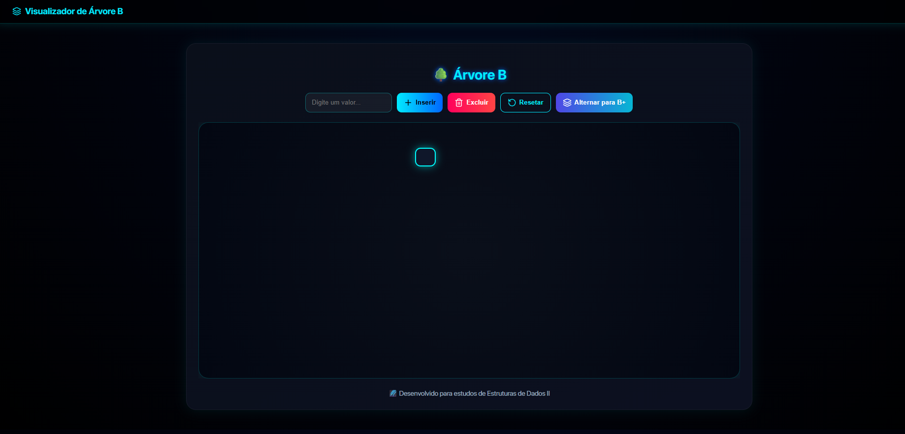

# 🌳 Visualizador Interativo de Árvores B e B+

<p align="center">
  
</p>

## 🔗 Demonstração Online

🚀 **Acesse agora:** [https://arvoreb.vercel.app](https://arvoreb.vercel.app)

---

## 📖 Sobre o Projeto

Este projeto é um **visualizador interativo de Árvores B e B+**, desenvolvido em **React + Vite**, com uma interface moderna em **modo escuro neon** inspirada no design da Apple e painéis de dados futuristas.

Permite:

- Inserir e remover valores em Árvores **B** e **B+** 🌳  
- Visualizar a estrutura balanceada em tempo real  
- Alternar entre tipos de árvore com animações suaves  
- Histórico visual de inserções e remoções  
- Interface responsiva com brilho e efeitos **neon animados**

---

## 🧠 Tecnologias Utilizadas

- ⚛️ **React.js + Vite**
- 💅 **CSS puro (tema escuro neon)**
- 🎞️ **Framer Motion** (animações fluidas)
- 🔔 **React Hot Toast** (feedback interativo)
- 🧩 **Lucide Icons** (ícones SVG modernos)

---

## ⚙️ Funcionalidades

| Função | Descrição |
|--------|------------|
| ➕ Inserir | Adiciona um valor na árvore com animação neon |
| ❌ Excluir | Remove o valor e reequilibra a árvore automaticamente |
| 🔁 Resetar | Limpa toda a árvore e reinicia |
| 🔄 Alternar | Alterna entre os modos **B** e **B+** |
| 🌈 Animações | Inserção e remoção com efeitos neon suaves |

---

## 🗂️ Estrutura do Projeto

src/
├── App.jsx # Interface principal
├── index.css # Estilo global (tema escuro neon)
├── components/
│ └── TreeCanvas.jsx # Renderização SVG e animações da árvore
└── structures/
├── TreeB.js # Implementação funcional da Árvore B
└── TreeBPlus.js # Implementação funcional da Árvore B+

yaml
Copiar código

---

## 🖥️ Como Executar Localmente

1. **Clone o repositório**

```bash
git clone https://github.com/seuusuario/arvoreb.git
cd arvoreb
Instale as dependências

bash
Copiar código
npm install
Inicie o servidor de desenvolvimento

bash
Copiar código
npm run dev
Acesse no navegador:

arduino
Copiar código
http://localhost:5173
🧩 Deploy
O projeto está hospedado gratuitamente na Vercel.
Para fazer seu próprio deploy:

bash
Copiar código
npm run build
vercel deploy
🧠 Conceitos Envolvidos
O projeto foi desenvolvido para fins educacionais na disciplina de Estrutura de Dados II, abordando:

Árvores B (balanceamento por chaves)

Árvores B+ (armazenamento de dados em folhas)

Inserção, divisão e remoção balanceadas

Representação hierárquica e visual dinâmica
